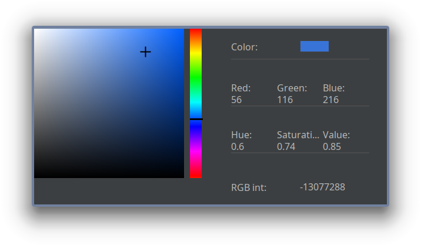

<br />
<p align="center">
  <h1 align="center">JColorDialog</h1>

  <p align="center">
    A nice looking, easy-to-use color dialog in Java.
  </p>
</p>


## About the project

JColorDialog is meant as an improvement over the default JColorChooser. It provides a better looking interface for to picking colors.



## Usage

The component is extremely easy to use. Simply add the following in your code:
```java
Color chosenColor = JColorDialog.showColorDialog();
```
Alternatively, you can also provide a starting color:
```java
Color myColor = Color.RED;
Color chosenColor = JColorDialog.showColorDialog(myColor);
```
